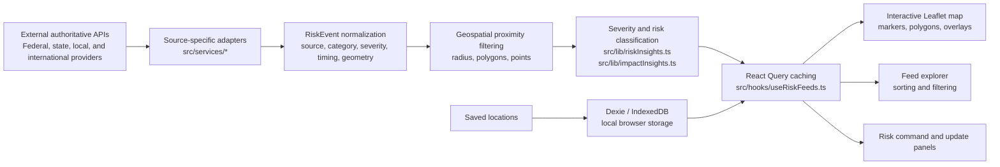

# 🌎 OpenRiskRadar

**Real-time hazard intelligence for the places that matter.**

[](https://github.com/SecuritahGuy/openrisk-radar/actions/workflows/ci.yml)
[](https://openriskradar.com)
[](LICENSE)

OpenRiskRadar is an open-source geospatial situational-awareness platform that aggregates public natural-hazard, severe-weather, disaster, air-quality, and environmental records from authoritative global and U.S. data sources. It currently provides a browser-based operational map, feed explorer, risk summary, local saved locations, and source-specific adapters for official hazard feeds across weather alerts, earthquakes, disaster declarations, wildfires, convective outlooks, tropical cyclones, global disasters, Earth observation events, and environmental conditions.

**Public website:** [https://openriskradar.com](https://openriskradar.com)

**Live radar:** [https://openriskradar.com/app](https://openriskradar.com/app)

## Product tracks

OpenRiskRadar has two intentionally separate product tracks.

### OpenRiskRadar Web

OpenRiskRadar Web is the existing open-source browser-first product. It is:

- Free to use.
- Open source.
- Anonymous.
- Browser-first.
- No-account.
- No authentication requirement.
- No subscription requirement.
- Independent of the native iOS product.

The website is a first-class public product, not a demo or an incomplete placeholder.

### OpenRiskRadar for iOS

OpenRiskRadar for iOS is a separate Apple-native product track. It will draw on the web project for source research, risk normalization, incident correlation, and UX learnings, but it will be a true native SwiftUI application, not a WebView wrapper. Android is a possible future native product track, but it is not the current implementation priority.

See [docs/native-app-strategy.md](docs/native-app-strategy.md) for the native app vision, CloudKit direction, and product boundaries.

**Quick Links:** [Architecture](#architecture) · [Data Sources](#live-data-sources) · [Roadmap](ROADMAP.md) · [Contributing](CONTRIBUTING.md) · [Native App Strategy](docs/native-app-strategy.md) · [iOS Product Requirements](docs/ios-product-requirements.md)

## Why OpenRiskRadar Web?

OpenRiskRadar Web is built to deliver authoritative situational awareness without requiring user registration or backend accounts. It is designed to stay public, open source, and anonymous while continuing to improve:

- authoritative data sources
- risk event normalization
- incident correlation and deduplication
- maps and visualizations
- risk summaries
- local-only saved locations
- accessibility and responsive design
- public documentation
- source attribution and developer experience

## Hero Screenshot

> Screenshot asset required: add the real application screenshot at `docs/assets/openrisk-radar-hero.png`.
>
> Recommended capture: desktop view of a searched location with the map, feed explorer, update panel, and active source filters visible.

<!--
After adding the asset, uncomment:

-->

## Why OpenRisk Radar?

Hazard intelligence is fragmented. Weather warnings, earthquakes, wildfires, disaster declarations, tropical cyclone advisories, global event feeds, and environmental signals are published by different agencies in different formats, with different geographic assumptions and update cycles. Operators, travelers, infrastructure teams, and security professionals often need one practical question answered quickly: what matters near this place right now?

OpenRisk Radar brings authoritative feeds into a single geospatial workflow. It normalizes events, evaluates proximity and impact, classifies severity, and presents the result on an interactive map and sortable feed without requiring users to assemble multiple agency dashboards by hand.

## Key Features

- Search by U.S. ZIP code, city/state, geocoded place, or map location.
- Interactive Leaflet map with radius rings, event markers, alert polygons, and optional NWS weather overlays.
- Optional dated NASA GIBS imagery with persisted layer, opacity, legends, and partial-tile status.
- Real-time source adapters for official government and public hazard feeds.
- Automatic GeoNet earthquake and elevated volcanic-alert coverage for resolved New Zealand locations.
- Automatic DWD official warning coverage for resolved German locations, filtered to the selected radius.
- Recent WHO Disease Outbreak News scoped by outbreak-title country; reports affect local posture only when they also name the searched state, county, or city.
- Normalized `RiskEvent` model for source, category, severity, timing, geometry, confidence, and attribution.
- Severity and impact classification for quick triage.
- Feed explorer with sorting by priority, source, category, severity, impact, distance, expiration, and update time.
- Source and severity filters for operational focus.
- Source-health reporting distinguishes usable cached data from hard feed failures, and time-sensitive sources use explicit freshness windows.
- Cloud watch audits isolate each location in its own queue invocation so provider fan-out remains within Cloudflare's per-invocation subrequest budget.
- Saved locations stored locally in browser IndexedDB through Dexie.
- Static browser-first architecture suitable for Cloudflare Pages or similar static hosting.

## Live Data Sources

This table reflects the current codebase. "Main dashboard" means the source is fetched through `useRiskFeeds` and appears in the map/feed path.

| Source | Coverage | Signals | Current status | Implementation |
|--------|----------|---------|----------------|----------------|
| National Weather Service (NWS) | United States | Active weather alerts by state | Main dashboard | `src/services/nws.ts` |
| NWS observations and forecast fallback | United States | Current conditions from stations, hourly forecast fallback | Current conditions panel | `src/services/weather.ts` |
| NWS weather overlay | United States | Forecast grid cell, hazards, heat risk, forecast zones, fire weather zones, nearby stations | Optional map overlay | `src/services/nwsWeatherOverlay.ts` |
| World Health Organization | Global, outbreak-title country matched | Recent Disease Outbreak News reports | Main dashboard and saved-location summaries; local posture only when the report names the searched state, county, or city | `src/services/who.ts` |
| Deutscher Wetterdienst (DWD) | Germany | Official severe-weather warning polygons | Main dashboard when a resolved German location and selected radius apply | `src/services/dwd.ts` |
| U.S. Geological Survey (USGS) | Global | Earthquakes by proximity | Main dashboard | `src/services/usgs.ts` |
| Federal Emergency Management Agency (FEMA) | United States | Disaster declarations by state/county | Main dashboard, feed/detail; no event geometry | `src/services/fema.ts` |
| National Interagency Fire Center (NIFC) | United States | Wildfires and prescribed burns by proximity | Main dashboard | `src/services/nifc.ts` |
| Selected state agencies | CA, FL, OR, NY, WI | Local wildfire incidents, evacuation zones, HAB reports, and beach advisories | Main dashboard when the resolved state applies | `src/services/regionalSources.ts` |
| USDOT WZDx / participating state DOTs | Participating U.S. states | Active and near-term work zones, lane impacts, and closures | Main dashboard when a keyless state feed applies | `src/services/transportation.ts` |
| Storm Prediction Center (SPC) | United States | Day 1-3 convective outlook polygons and preliminary observed tornado, hail, and wind reports | Main dashboard | `src/services/spc.ts`, `src/services/spcReports.ts` |
| National Hurricane Center (NHC) | Atlantic and Eastern/Central Pacific | Active tropical cyclones | Main dashboard when active/in range | `src/services/nhc.ts` |
| Global Disaster Alert and Coordination System (GDACS) | Global | Earthquakes, tropical cyclones, floods, volcanoes, wildfires, droughts | Main dashboard | `src/services/gdacs.ts` |
| NASA EONET | Global | Earth observation natural events | Main dashboard | `src/services/eonet.ts` |
| Open-Meteo | Global | Weather fallback, air quality, marine conditions | Current conditions fallback and environmental signals panel | `src/services/openMeteo.ts` |
| Nominatim / OpenStreetMap | Global | Geocoding and reverse geocoding | Location resolution fallback | `src/services/nominatim.ts` |
| Local lookup tables | United States | ZIP/city/state/county/FIPS lookup | Fast location resolution | `src/data/` |
| OpenStreetMap tiles | Global | Base map tiles | Map rendering | Leaflet tile layer |

## How It Works

1. The user searches for a place or clicks the map.
2. Local ZIP/city lookup and geocoding resolve coordinates and administrative context.
3. Source-specific adapters call authoritative public APIs.
4. Source records normalize into `RiskEvent` objects where they participate in common filtering, sorting, severity, and impact logic.
5. React Query caches feed results by location, radius, and source-specific parameters.
6. Leaflet renders points, polygons, radius rings, weather overlays, and popups.
7. Dexie stores saved locations locally in browser IndexedDB.

## Architecture



### Technical Architecture

OpenRiskRadar is a React application delivered as static assets. It calls most public APIs directly from the browser, uses TanStack React Query for request caching and refresh behavior, normalizes event data into shared TypeScript models, and renders geospatial state with Leaflet/react-leaflet. Saved locations are stored in browser IndexedDB through Dexie by default. Narrow Cloudflare Worker routes proxy browser-incompatible feeds, and the explicitly enabled cloud-watch feature uses a Worker, scheduled audits, D1, queues, and Web Push. Automatic push delivery is currently limited to a deterministic 10% canary. There is no user account or authentication system.

## Stack

- React 18 + TypeScript
- Vite
- Leaflet + react-leaflet
- TanStack React Query
- Dexie / IndexedDB
- Turf.js
- ESLint
- Cloudflare-compatible static deployment

## Getting Started

Requires Node 22.

```bash
npm ci
npm run dev
```

Local app: `http://localhost:5173`

Production app: [https://openriskradar.com](https://openriskradar.com)

## Website routes and content

- `/` is the public landing page.
- `/app` lazy-loads the operational map dashboard.
- `/learn` and `/learn/*` contain educational guides.
- `/data-sources` and `/methodology` document providers and processing.
- `/about`, `/privacy`, `/terms`, and `/contact` provide project and policy information.

Cloudflare's static-asset SPA fallback serves `index.html` for direct route requests, while Worker execution remains limited to `/api/*`. The service worker treats `/app` as the installable application shell and does not replace uncached public pages with the dashboard when offline. See [docs/site-architecture.md](docs/site-architecture.md) and [docs/cloudflare-pages.md](docs/cloudflare-pages.md).

Learning articles live in `src/data/learnArticles.ts`. Add metadata, original sections, authoritative source links, and a route entry in `src/routes.ts`, then add the canonical URL to `public/sitemap.xml`. Data-source cards are maintained in `src/data/dataSources.ts`; verify them against service adapters, provider documentation, and actual React Query cache settings.

Copy `.env.example` to `.env.local` for optional configuration. `VITE_SITE_URL` controls canonical metadata and `VITE_CONTACT_EMAIL` enables a public contact link. Advertising is disabled by default. `VITE_GOOGLE_ADSENSE_CLIENT` alone does not activate ads: consent handling, CSP work, approved slot IDs, and a real publisher record are still required. `/app`, `/privacy`, `/terms`, `/contact`, and `/404` are intentionally ad-free. When approved, copy `public/ads.txt.example` to `public/ads.txt` and replace the placeholder with the exact account record.

Before a production release, run `npm run lint`, `npm test`, `npm run build`, `npm run worker:check`, `npm run test:e2e`, and the deployed `npm run smoke:production`. Manually verify direct refreshes, browser navigation, saved locations, API responses, service-worker upgrades, metadata, sitemap, robots, and the apex/`www` redirect.

## Available Scripts

| Command | Description |
|---------|-------------|
| `npm run dev` | Start the Vite development server |
| `npm run lint` | Run ESLint |
| `npm run build` | Type-check and build the production bundle |
| `npm run preview` | Preview the production build locally |
| `npm test` | Run focused Vitest checks for deterministic logic |
| `npm run test:e2e` | Run Chromium viewport, persistence, and axe regressions |
| `npm run worker:check` | Compile the Cloudflare Worker with a dry-run deploy |

## Data and Privacy

- Location searches are used to query public hazard APIs from the browser.
- Saved locations are stored locally in the user's browser IndexedDB unless the implementation changes in the future.
- Local saves use no account or backend database; only explicitly enabled cloud watches and push subscriptions are copied to D1.
- No API keys or secrets are required for the current public data sources.
- Browser direct API usage means provider CORS and public endpoint policies matter; see [Cloudflare Pages deployment notes](docs/cloudflare-pages.md).

## Roadmap

See [ROADMAP.md](ROADMAP.md) for active sources, next integrations, and future research areas.

## Contributing

Contributions are welcome. Start with [CONTRIBUTING.md](CONTRIBUTING.md), run lint/build/test locally, preserve data-provider attribution, and avoid committing secrets or API keys.

Good first contributions include:

- Data-source adapter hardening.
- Focused tests for normalization and severity mapping.
- Documentation and screenshots.
- Accessibility and responsive UI refinements.
- Source-specific detail panel improvements.

## License

MIT License. See [LICENSE](LICENSE).

## Data Provider Acknowledgments

OpenRiskRadar depends on public data and APIs from the National Weather Service, U.S. Geological Survey, FEMA, National Interagency Fire Center, NOAA Storm Prediction Center, National Hurricane Center, GDACS, NASA EONET, Open-Meteo, Nominatim/OpenStreetMap, and OpenStreetMap tile contributors. Each provider retains ownership of its data and terms of use.

## Support

If OpenRiskRadar is useful to you, please star the repository: [github.com/SecuritahGuy/openrisk-radar](https://github.com/SecuritahGuy/openrisk-radar).
