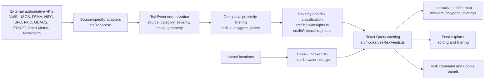

# 🌎 OpenRisk Radar

**Real-time hazard intelligence for the places that matter.**

[](https://github.com/SecuritahGuy/openrisk-radar/actions/workflows/ci.yml)
[](https://openriskradar.com)
[](LICENSE)

OpenRisk Radar is an open-source geospatial situational-awareness platform that aggregates real-time natural hazard, severe weather, disaster, air-quality and environmental risk intelligence from authoritative global and U.S. data sources. It currently provides a browser-based operational map, feed explorer, risk summary, local saved locations, and source-specific adapters for official hazard feeds across weather alerts, earthquakes, disaster declarations, wildfires, convective outlooks, tropical cyclones, global disasters, Earth observation events, and environmental conditions.

**Live application:** [https://openriskradar.com](https://openriskradar.com)

**Quick Links:** [Architecture](#architecture) · [Data Sources](#live-data-sources) · [Roadmap](ROADMAP.md) · [Contributing](CONTRIBUTING.md)

## Hero Screenshot

> Screenshot asset required: add the real application screenshot at `docs/assets/openrisk-radar-hero.png`.
>
> Recommended capture: desktop view of a searched location with the map, feed explorer, update panel, and active source filters visible.

<!--
After adding the asset, uncomment:

-->

## Why OpenRisk Radar?

Hazard intelligence is fragmented. Weather warnings, earthquakes, wildfires, disaster declarations, tropical cyclone advisories, global event feeds, and environmental signals are published by different agencies in different formats, with different geographic assumptions and update cycles. Operators, travelers, infrastructure teams, and security professionals often need one practical question answered quickly: what matters near this place right now?

OpenRisk Radar brings authoritative feeds into a single geospatial workflow. It normalizes events, evaluates proximity and impact, classifies severity, and presents the result on an interactive map and sortable feed without requiring users to assemble multiple agency dashboards by hand.

## Key Features

- Search by U.S. ZIP code, city/state, geocoded place, or map location.
- Interactive Leaflet map with radius rings, event markers, alert polygons, and optional NWS weather overlays.
- Real-time source adapters for official government and public hazard feeds.
- Normalized `RiskEvent` model for source, category, severity, timing, geometry, confidence, and attribution.
- Severity and impact classification for quick triage.
- Feed explorer with sorting by priority, source, category, severity, impact, distance, expiration, and update time.
- Source and severity filters for operational focus.
- Saved locations stored locally in browser IndexedDB through Dexie.
- Static browser-first architecture suitable for Cloudflare Pages or similar static hosting.

## Live Data Sources

This table reflects the current codebase. "Main dashboard" means the source is fetched through `useRiskFeeds` and appears in the map/feed path.

| Source | Coverage | Signals | Current status | Implementation |
|--------|----------|---------|----------------|----------------|
| National Weather Service (NWS) | United States | Active weather alerts by state | Main dashboard | `src/services/nws.ts` |
| NWS observations and forecast fallback | United States | Current conditions from stations, hourly forecast fallback | Current conditions panel | `src/services/weather.ts` |
| NWS weather overlay | United States | Forecast grid cell, hazards, heat risk, forecast zones, fire weather zones, nearby stations | Optional map overlay | `src/services/nwsWeatherOverlay.ts` |
| U.S. Geological Survey (USGS) | Global | Earthquakes by proximity | Main dashboard | `src/services/usgs.ts` |
| Federal Emergency Management Agency (FEMA) | United States | Disaster declarations by state/county | Main dashboard, feed/detail; no event geometry | `src/services/fema.ts` |
| National Interagency Fire Center (NIFC) | United States | Wildfires and prescribed burns by proximity | Main dashboard | `src/services/nifc.ts` |
| Storm Prediction Center (SPC) | United States | Day 1-3 convective outlook polygons | Main dashboard | `src/services/spc.ts` |
| National Hurricane Center (NHC) | Atlantic and Eastern/Central Pacific basins | Active tropical cyclones | Main dashboard when active/in range | `src/services/nhc.ts` |
| Global Disaster Alert and Coordination System (GDACS) | Global | Earthquakes, tropical cyclones, floods, volcanoes, wildfires, droughts | Main dashboard | `src/services/gdacs.ts` |
| NASA EONET | Global | Wildfires, storms, volcanoes, floods, ice, landslides, dust, drought and related Earth observation events | Main dashboard | `src/services/eonet.ts` |
| Open-Meteo | Global | Weather fallback, air quality, marine conditions | Current conditions fallback and environmental signals panel | `src/services/openMeteo.ts` |
| Nominatim / OpenStreetMap | Global | Geocoding and reverse geocoding | Location resolution fallback | `src/services/nominatim.ts` |
| Local lookup tables | United States | ZIP/city/state/county/FIPS lookup | Fast location resolution | `src/data/` |
| OpenStreetMap tiles | Global | Base map tiles | Map rendering | Leaflet tile layer |

## How It Works

1. The user searches for a place or clicks the map.
2. Local ZIP/city lookup and geocoding resolve coordinates and administrative context.
3. Source-specific adapters call authoritative public APIs.
4. Source records normalize into `RiskEvent` objects where they participate in common filtering, sorting, severity, and impact logic.
5. React Query caches feed results by location, radius, and source-specific parameters.
6. Leaflet renders points, polygons, radius rings, weather overlays, and popups.
7. Dexie stores saved locations locally in browser IndexedDB.

## Architecture



### Technical Architecture

OpenRisk Radar is a static React application. It calls public APIs directly from the browser, uses TanStack React Query for request caching and refresh behavior, normalizes event data into shared TypeScript models, and renders geospatial state with Leaflet/react-leaflet. Saved locations are local-only browser data stored in IndexedDB through Dexie. There is currently no backend database, scheduled worker, user account system, or server-side ingestion pipeline in the baseline deployment.

## Stack

- React 18 + TypeScript
- Vite
- Leaflet + react-leaflet
- TanStack React Query
- Dexie / IndexedDB
- Turf.js
- ESLint
- Cloudflare-compatible static deployment

## Getting Started

Requires Node 22.

```bash
npm ci
npm run dev
```

Local app: `http://localhost:5173`

Production app: [https://openriskradar.com](https://openriskradar.com)

## Available Scripts

| Command | Description |
|---------|-------------|
| `npm run dev` | Start the Vite development server |
| `npm run lint` | Run ESLint |
| `npm run build` | Type-check and build the production bundle |
| `npm run preview` | Preview the production build locally |
| `npm test` | Run focused Vitest checks for deterministic logic |

## Data and Privacy

- Location searches are used to query public hazard APIs from the browser.
- Saved locations are stored locally in the user's browser IndexedDB unless the implementation changes in the future.
- There is no application backend database in the current static deployment.
- No API keys or secrets are required for the current public data sources.
- Browser direct API usage means provider CORS and public endpoint policies matter; see [Cloudflare Pages deployment notes](docs/cloudflare-pages.md).

## Roadmap

See [ROADMAP.md](ROADMAP.md) for active sources, next integrations, and future research areas.

## Contributing

Contributions are welcome. Start with [CONTRIBUTING.md](CONTRIBUTING.md), run lint/build/test locally, preserve data-provider attribution, and avoid committing secrets or API keys.

Good first contributions include:

- Data-source adapter hardening.
- Focused tests for normalization and severity mapping.
- Documentation and screenshots.
- Accessibility and responsive UI refinements.
- Source-specific detail panel improvements.

## License

MIT License. See [LICENSE](LICENSE).

## Data Provider Acknowledgments

OpenRisk Radar depends on public data and APIs from the National Weather Service, U.S. Geological Survey, FEMA, National Interagency Fire Center, NOAA Storm Prediction Center, National Hurricane Center, GDACS, NASA EONET, Open-Meteo, Nominatim/OpenStreetMap, and OpenStreetMap tile contributors. Each provider retains ownership of its data and terms of use.

## Support

If OpenRisk Radar is useful to you, please star the repository: [github.com/SecuritahGuy/openrisk-radar](https://github.com/SecuritahGuy/openrisk-radar).
